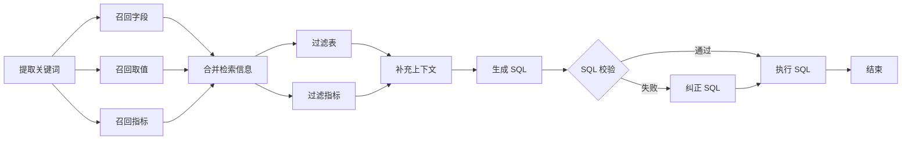

# Data Agent — 智能数据分析助手

基于大语言模型（LLM）与 LangGraph 工作流引擎的智能数据分析系统，支持自然语言查询数据仓库，自动生成并执行 SQL，最终返回分析结果。

## 系统架构

```
用户查询 → [FastAPI] → [LangGraph Agent Pipeline] → [MySQL / Qdrant / ES] → SQL → 结果
                ⇅
           [Vue 3 Frontend]
```

- **Frontend**: Vue 3 + Vite + ECharts（SSE 流式展示进度与结果）
- **Backend**: FastAPI + LangGraph + LangChain（Agent 工作流引擎）
- **Metastore**: MySQL 存储表结构、字段与指标元数据
- **Vector DB**: Qdrant 存储字段与指标的向量索引，支持语义召回
- **Full‑text**: Elasticsearch 存储字段取值，支持模糊搜索
- **Embedding**: HuggingFace TEI（BAAI/bge-large-zh-v1.5）生成文本向量
- **LLM**: 兼容 OpenAI API 的大模型（如 DeepSeek），用于 SQL 生成

## Agent 工作流

LangGraph 编排的有向无环图，包含以下节点：



## 项目结构

```
data-agent-project/
├── backend/                    # FastAPI 后端
│   ├── app/
│   │   ├── agent/              # LangGraph Agent 定义与节点
│   │   │   └── nodes/          # 各工作流节点实现
│   │   ├── api/                # REST 路由与请求 Schema
│   │   ├── clients/            # MySQL / Qdrant / ES / Embedding 客户端
│   │   ├── conf/               # 配置加载（结构化配置 + YAML）
│   │   ├── core/               # 应用生命周期与日志
│   │   ├── entities/           # 领域实体定义
│   │   ├── models/             # SQLAlchemy ORM 模型
│   │   ├── prompt/             # Prompt 加载器
│   │   ├── repositories/       # 数据仓库层（MySQL / Qdrant / ES）
│   │   ├── scripts/            # 元数据知识库构建脚本
│   │   └── services/           # 业务服务层
│   ├── conf/                   # 应用配置文件
│   ├── docker/                 # Dockerfile
│   ├── prompts/                # LLM Prompt 模板
│   └── tests/                  # 测试
├── frontend/                   # Vue 3 前端
│   └── src/
│       ├── components/         # 组件（侧栏、聊天、表格等）
│       ├── composables/        # 组合式 API（Chat、Storage）
│       └── utils/              # 导出工具
├── docker/                     # Docker Compose 基础设施
│   ├── elasticsearch/
│   ├── mysql/                  # 初始化 SQL
│   └── embedding/              # 本地 Embedding 模型
└── docker-compose.yaml         # 一键启动基础设施
```

## 快速开始

### 前置要求

- Python >= 3.12
- Node.js >= 18
- Docker & Docker Compose（可选，用于启动基础设施）

### 1. 启动基础设施

```bash
docker compose -f docker/docker-compose.yaml up -d
```

将启动以下服务：

| 服务 | 端口 | 用途 |
|------|------|------|
| MySQL | 3306 | 元数据 + 数据仓库 |
| Elasticsearch | 9200 | 值全文索引 |
| Kibana | 5601 | ES 管理界面 |
| Qdrant | 6333 | 向量数据库 |
| TEI Embedding | 8081 | 文本向量化 |

### 2. 初始化数据库

```bash
# 导入建表语句
docker exec -i mysql mysql -uroot -p  < docker/mysql/meta.sql
docker exec -i mysql mysql -uroot -p  < docker/mysql/dw.sql
```

### 3. 启动后端

```bash
cd data-agent-project/backend

# 创建虚拟环境并安装依赖
uv venv
uv sync

# 复制配置并修改 API Key
cp conf/app_config.yaml app/conf/

# 构建元数据知识库（首次运行）
uv run python -m app.scripts.build_meta_knowledge --config ./conf/meta_config.yaml

# 启动 API 服务
uv run python main.py
```

### 4. 启动前端

```bash
cd data-agent-project/frontend
npm install
npm run dev
```

浏览器打开 `http://localhost:5173` 即可使用。

## 配置说明

配置文件位于 `backend/conf/app_config.yaml`，主要配置项：

| 配置 | 说明 |
|------|------|
| `llm.api_key` | LLM 的 API Key |
| `llm.base_url` | OpenAI 兼容 API 地址 |
| `embedding.api_key` | HuggingFace API Key（可选） |
| `db_meta` / `db_dw` | MySQL 连接信息 |
| `qdrant` | Qdrant 向量数据库配置 |
| `es` | Elasticsearch 配置 |

## 元数据配置

编辑 `backend/conf/meta_config.yaml`，定义数据表、字段和指标的映射关系：

```yaml
tables:
  - name: dw.dim_customer
    role: dim
    description: 客户维度表
    columns:
      - name: member_level
        role: dimension
        description: 会员等级
        alias: ["会员等级", "会员级别"]
        sync: true

metrics:
  - name: 平均客单价
    description: 总销售金额 ÷ 总订单数
    relevant_columns:
      - facts.order_fact.amount
      - facts.order_fact.order_id
    alias: ["均单价", "客单价"]
```

## 技术栈

- **Python**: FastAPI, LangGraph, LangChain, SQLAlchemy, Qdrant Client
- **JS**: Vue 3, Vite, ECharts
- **Infra**: Docker, MySQL, Elasticsearch, Qdrant, HuggingFace TEI

## License

MIT
